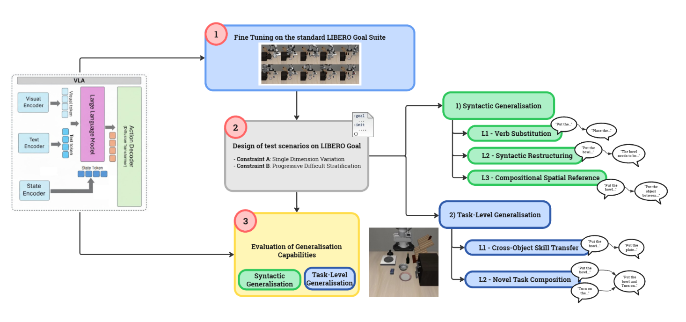

<div align="center">

<h1>Evaluating Generalization of State-of-the-Art Multi-Task Language-Conditioned Imitation Learning Systems</h1>


</div>

<p align="center">
  <em>A Vision-Language-Action Models Evaluation Framework for Zero-Shot Syntactic and Task-Level Generalization</em>
</p>

> [!NOTE]
> This repository reports the main implementation choices and experimental outcomes. For full methodological details, ablation study, and extended discussion, please refer to the thesis PDF in [documents/Cardamone_Agostino_0622702276_Thesis.pdf](documents/Cardamone_Agostino_0622702276_Thesis.pdf).

## Project Objective

Modern robotic manipulation systems are increasingly expected to execute diverse language-conditioned tasks under conditions not explicitly observed during training. This work addresses the following question:

> **"What are the capabilities of modern Vision-Language-Action (VLA) models to adapt to new scenarios that differ from those seen during training?"**

Existing benchmarks (e.g., LIBERO, COLOSSEUM, MimicLab) primarily evaluate robustness to visual perturbations (changes in lighting, object appearance, or scene layout) and do not systematically address linguistic variation or task composition.

### Main Contributions

- Design and implementation of a controlled, reproducible benchmark for zero-shot generalization in VLA models, organized along two generalization dimensions and structured into levels of increasing difficulty.
- Definition of two complementary generalization axes: **Syntactic Generalization** (Verb Substitution, Syntactic Restructuring, Compositional Spatial Reference) and **Task-Level Generalization** (Cross-Object Skill Transfer, Novel Task Composition).
- Empirical evaluation of three state-of-the-art VLA models based on distinct pre-training paradigms: OpenVLA-OFT, TinyVLA, and InternVLA-M1.
- Detailed failure analysis of robot trajectories via rollout video inspection and end-effector heatmaps to identify execution-stage failure modes per architecture.
- Embedding-based validation of instruction variants using cosine similarity, Euclidean distance, and normalized Levenshtein distance to verify semantic preservation across reformulation levels.
- Ablation study to distinguish genuine compositional generalization from training-distribution artifacts in Task-Level Generalization results.
- Targeted Level-3 fine-tuning of InternVLA-M1 with selective backbone freezing to mitigate catastrophic forgetting and improve compositional spatial reference resolution.

### Evaluation Framework Pipeline Overview



*Figure: End-to-end workflow of the proposed evaluation framework, from scenario design and model fine-tuning to syntactic/task-level generalization assessment.*

## Repository Structure

```text
📦Evaluating-Generalization-of-State-of-the-Art-Multi-Task-Language-Conditioned-Imitation-Learning-Systems
┣📂checkpoints/
┣📂datasets/
┃  ┗📂lerobot_libero_goal_l3/
┣📂LIBERO/
┃  ┣📂benchmark_scripts/
┃  ┣📂scripts/
┃  ┗📂libero/
┣📂models/
┃  ┣📂openvla-oft/
┃  ┣📂TinyVLA/
┃  ┗📂InternVLA-M1/
┣📂outputs/
┃  ┣📂embeddings/
┃  ┗📂results/
┗📜README.md
```

## Generalization Benchmark

The benchmark evaluates two dimensions of zero-shot generalization on the **LIBERO-Goal suite** (10 tabletop manipulation tasks). Each evaluation level is tested with multiple instruction variants per task, executed over three independent random seeds. Success rate is averaged across variants and seeds to produce statistically robust estimates.

### 1) Syntactic Generalization

- **Level 1 - Verb Substitution:** lexical verb replacement while preserving task semantics.
- **Level 2 - Syntactic Restructuring:** imperative instructions rewritten in declarative/passive forms.
- **Level 3 - Compositional Spatial Reference:** key object mention replaced by relational spatial descriptions.

#### Syntactic Generalization Test Instruction Examples

| Task No. | Original Task Command | L1 Variation Task Command | L2 Variation Task Command | L3 Variation Task Command |
|:---:|---|---|---|---|
| 1 | Open the middle layer of the drawer | **Pull** the middle layer of the drawer | **The middle layer of the drawer needs to be opened** | Open the layer of the drawer **located between the top and bottom** |
| 2 | Put the bowl on the stove | **Set** the bowl on the stove | **The stove needs to have the bowl on it** | Put **the object between the wine bottle and the cream cheese** on the stove |
| 3 | Put the wine bottle on the top of the cabinet | **Place** the wine bottle on the top of the cabinet | **Top of the cabinet needs to have the wine bottle on it** | Put **the object behind the bowl** on the top of the cabinet |
| 4 | ... | ... | ... | ... |


### 2) Task-Level Generalization

- **Level 1 - Cross-Object Skill Transfer:** known primitive applied to a different but known object.
- **Level 2 - Novel Task Composition:** sequential composition of known primitives never demonstrated together.

#### Task Generalization Test Instruction Examples

| Task No. | Training Task Command | Test Task Command |
|:---:|---|---|
| 1 | Put the bowl on the top of the cabinet | Put **the plate** on the top of the cabinet |
| 2 | Put the bowl on the stove | Put **the plate** on the stove |
| 3 | Put the wine bottle on the top of the cabinet | Put **the cream cheese** on the top of the cabinet |
| 4 | ... | ... |

## Models Evaluated

Three VLA models were selected to represent distinct pre-training paradigms and architectural designs. Each model was fine-tuned on the same shared set of LIBERO-Goal expert demonstrations before zero-shot evaluation.

### OpenVLA-OFT

- Prismatic-7B backbone (DINOv2 + SigLIP encoders + LLaMA-2 7B decoder).
- LoRA fine-tuning (rank 64), parallel decoding, continuous l1 regression objective, and action chunking.
- Fine-tuned on LIBERO-Goal for 50,000 steps on 4 x NVIDIA A100 GPUs.

```bibtex
@inproceedings{kim2025finetune,
  author    = {Kim, Moo Jin and Finn, Chelsea and Liang, Percy},
  title     = {Fine-Tuning Vision-Language-Action Models: Optimising Speed and Success},
  booktitle = {Proceedings of Robotics: Science and Systems (RSS)},
  address   = {Los Angeles, CA, USA},
  year      = {2025}
}
```

### TinyVLA

- Compact VLM backbone (< 1.4B parameters) in a LLaVA-style pipeline (ViT + GPT-NeoX/Pythia LM).
- Diffusion Policy (DDPM) action head.
- Fine-tuned for 55,000 steps on 4 x NVIDIA A100 GPUs with LoRA (rank 64, alpha = 256).

```bibtex
@article{wen2025tinyvla,
  author  = {Wen, Junjie and others},
  title   = {TinyVLA: Toward Fast, Data-Efficient Vision-Language-Action Models for Robotic Manipulation},
  journal = {IEEE Robotics and Automation Letters},
  year    = {2025}
}
```

### InternVLA-M1 (from ST4VLA, ICLR 2026)

- Dual-system architecture:
	- VLM Planner: Qwen2.5-VL-3B for high-level spatially grounded reasoning.
	- DiT-B Action Expert for low-level control.
	- Q-Former bridge between planner and control modules.
- Evaluated with the publicly released checkpoint fine-tuned on LIBERO-Goal for 30,000 steps.

```bibtex
@inproceedings{ye2026st4vla,
  title     = {ST4VLA: Spatially Guided Training for Vision-Language-Action Models},
  author    = {Ye, Jinhui and Wang, Fangjing and Gao, Ning and Yu, Junqiu and Zhu, Yangkun and Wang, Bin and Zhang, Jinyu and Jin, Weiyang and Fu, Yanwei and Zheng, Feng and Chen, Yilun and Pang, Jiangmiao},
  booktitle = {International Conference on Learning Representations (ICLR)},
  year      = {2026}
}
```

### L3 Fine-Tuning Dataset (`lerobot_libero_goal_l3`)

To support the targeted L3 adaptation study, this repository includes a dedicated dataset at `datasets/lerobot_libero_goal_l3/`.

#### Why This Dataset Was Created

- Baseline and zero-shot results show that **Level 3 (Compositional Spatial Reference)** is the hardest syntactic setting.
- Standard LIBERO-Goal instructions do not provide sufficient coverage of indirect relational references (e.g., "the object between X and Y").
- The dataset enables a controlled study of whether targeted supervision on L3 language can improve compositional generalization.

```bibtex
@inproceedings{liu2023libero,
  author    = {Liu, Bo and Zhu, Yifeng and Gao, Chao and Feng, Yuke and Liu, Qiang and Zhu, Yixin and Stone, Peter},
  title     = {LIBERO: Benchmarking Knowledge Transfer for Lifelong Robot Learning},
  booktitle = {Advances in Neural Information Processing Systems (NeurIPS)},
  year      = {2023}
}
```

#### How It Is Composed

- The dataset is organized as **27 task-variant subdatasets** (e.g., `put_the_bowl_on_the_stove_syn_l3_v1`, `..._v2`, `..._v3`).
- Variants follow L3 relational reformulations and include **two or three variants per task** (v1/v2/v3), for a total of multiple L3 linguistic realizations.
- Each subdataset follows a LeRobot-style layout:
	- `data/chunk-000/` (parquet episodes)
	- `meta/` (`episodes.jsonl`, `tasks.jsonl`, `info.json`, normalization stats)
	- `videos/chunk-000/` (paired camera streams)
- Observations/actions are consistent with LIBERO-Goal setup used in this work:
	- third-person RGB + wrist RGB at 256x256,
	- proprioceptive state (8-DoF),
	- continuous action vector (7-DoF),
	- 20 Hz recording.

#### Fine-Tuning Protocol Enabled by This Dataset

- Targeted InternVLA-M1 fine-tuning is run with controlled episode budgets per task-variant (e.g., 10/25/50) to study sample-efficiency.
- The protocol is designed to measure gains on L3 while monitoring retention of previously learned skills.

## Installation and Requirements

### 1) Clone Repository

```bash
git clone --recurse-submodules https://github.com/Crostino14/Evaluating-Generalization-of-Sota-Multi-Task-Language-Conditioned-Imitation-Learning-Systems.git
cd Evaluating-Generalization-of-Sota-Multi-Task-Language-Conditioned-Imitation-Learning-Systems
```

### 2) Create Environment (Conda Recommended)

```bash
# OpenVLA-OFT (LIBERO evaluation environment)
conda env create -f models/openvla-oft/experiments/env_requirements/openvla-oft_libero.yml

# TinyVLA (First env is for evaluation, second for training)
conda env create -f models/TinyVLA/test/env_requirements/tinyvla_libero.yml
conda env create -f models/TinyVLA/test/env_requirements/tinyvla.yml

# InternVLA-M1 (LIBERO evaluation and embeddings analysis)
conda env create -f models/InternVLA-M1/test/env_requirements/internvla-m1_libero.yml
conda env create -f models/InternVLA-M1/test/env_requirements/internvla-m1_embeddings.yml
```

### 3) Install Core Dependencies

```bash
pip install -r LIBERO/requirements.txt
pip install -e LIBERO
```

### 4) Install Model-Specific Dependencies

```bash
# TinyVLA
conda activate tinyvla_libero
pip install -r models/TinyVLA/test/env_requirements/libero_test_requirements.txt

# InternVLA-M1
conda activate internvla-m1
pip install -r models/InternVLA-M1/test/env_requirements/libero_test_requirements.txt

# OpenVLA-OFT
conda activate openvla-oft
pip install -r models/openvla-oft/experiments/env_requirements/libero_test_requirements.txt
```

## Usage - Running Experiments

### 1) Embeddings Analysis

> ⚠️
> Before running any command in this section, update all absolute paths in the referenced `.sh`/`.py` scripts and related config files (`.yaml`, `.json`) to match your local or HPC environment. 

```bash
# ==========================================
# OpenVLA-OFT
# ==========================================
conda activate openvla-oft

# SLURM launcher (HPC)
sbatch models/openvla-oft/experiments/libero/embeddings_test/extract_embeddings_rollout.sh

# Overlap analysis (cosine / euclidean / normalized Levenshtein)
python models/openvla-oft/experiments/libero/embeddings_test/analyze_embedding_overlap_rollout.py \
	--embedding_dir outputs/embeddings/openvla \
	--output_csv outputs/embeddings/openvla/openvla_overlap_analysis.csv


# ==========================================
# TinyVLA
# ==========================================
conda activate tinyvla_libero

# SLURM launcher (HPC)
sbatch models/TinyVLA/test/libero_test/embeddings_test/extract_embeddings_rollout.sh

# Overlap analysis
python models/TinyVLA/test/libero_test/embeddings_test/analyze_embedding_overlap_rollout.py \
	--embedding_dir outputs/embeddings/tinyvla \
	--output_csv outputs/embeddings/tinyvla/tinyvla_overlap_analysis.csv


# ==========================================
# InternVLA-M1
# ==========================================
conda activate internvla-m1-embeddings

# SLURM launcher (HPC)
sbatch models/InternVLA-M1/test/libero_test/embeddings_test/run_extract_internvla_embeddings_rollout.sh

# Overlap analysis
python models/InternVLA-M1/test/libero_test/embeddings_test/analyze_embedding_overlap_rollout_internvla.py \
	--embedding_dir outputs/embeddings/internvla \
	--output_csv outputs/embeddings/internvla/internvla_overlap_analysis.csv

```

### 2) Fine-Tuning Commands

> ⚠️
> Before running any command in this section, update all absolute paths in the referenced `.sh` scripts and related training/config files (`.py`, `.yaml`, `.json`) to match your local or HPC environment.

```bash
# OpenVLA-OFT
conda activate openvla-oft
sbatch models/openvla-oft/vla-scripts/finetune_libero_goal.sh


# TinyVLA
conda activate tinyvla_libero
sbatch models/TinyVLA/scripts/train.sh


# InternVLA-M1 - Syntactic Generalisation Finetuning on Level 3 (Compositional Spatial Reference)
conda activate internvla-m1
sbatch models/InternVLA-M1/test/libero_test/finetune_internvla_libero_goal_l3.sh

```

### 3) Evaluation Commands

> ⚠️
> Before running any command in this section, update all absolute paths in the referenced `.sh` scripts and related training/config files (`.py`, `.yaml`, `.json`) to match your local or HPC environment.

```bash
# OpenVLA-OFT
sbatch models/openvla-oft/experiments/libero/run_libero_eval.sh
sbatch models/openvla-oft/experiments/libero/run_libero_eval_task_comp.sh

# TinyVLA
sbatch models/TinyVLA/test/libero_test/run_libero_eval.sh
sbatch models/TinyVLA/test/libero_test/run_libero_eval_task_comp.sh

# InternVLA-M1
sbatch models/InternVLA-M1/test/libero_test/run_internvla_libero_eval.sh
sbatch models/InternVLA-M1/test/libero_test/run_internvla_libero_task_comp.sh
```

## Results

### Key Findings

- All models maintain near-baseline performance at **Syntactic Level 1** (Verb Substitution), confirming that robustness to shallow lexical variation is related to the VLM backbone pre-training on large-scale data.
- Performance degrades progressively across syntactic levels, with **Level 3 (Compositional Spatial Reference)** causing the sharpest drop — from about 90% baseline to 13.6% (OpenVLA-OFT), 40.4% (TinyVLA), and 39.0% (InternVLA-M1).
- **Task-Level Generalization Level 1** (Cross-Object Skill Transfer) yields 0.0% for all three models, revealing that skill–object bindings are rigid and do not transfer to novel object instances.
- Non-zero results at **Task-Level Level 2** (Novel Task Composition) are explained by the ablation study as training-distribution artifacts rather than genuine compositional generalization.
- Failure patterns are architecture-specific: TinyVLA exhibits **lexical anchoring** (motor plan triggered by the most salient object token regardless of context), OpenVLA-OFT exhibits **goal-location bias** (target object substituted with the one most associated with the goal location), and InternVLA-M1 **fails to resolve relational spatial references** (when the target is described indirectly, e.g., "the object between X and Y", the model cannot ground the spatial clause onto the correct referent and defaults to a lexically prominent anchor).

### Syntactic Generalization Test Results

> For each evaluation level, multiple instruction variants per task are tested across 3 random seeds. Success rate is averaged across variants and seeds.

| Model | Baseline Mean SR% ± Std% | Level 1 Mean SR% ± Std% | Level 2 Mean SR% ± Std% | Level 3 Mean SR% ± Std% |
|:---:|:---:|:---:|:---:|:---:|
| OpenVLA-OFT | 96.5% ± 0.5% | 95.9% ± 4.5% | 93.4% ± 8.8% | 13.6% ± 17.6% |
| TinyVLA | 88.6% ± 0.7% | 84.6% ± 9.3% | 80.8% ± 11.2% | 40.4% ± 36.4% |
| InternVLA-M1 | 94.3% ± 0.5% | 89.0% ± 8.6% | 85.7% ± 10.9% | 39.0% ± 23.2% |


### Task Generalization Test Results

| Model | Baseline Mean SR% ± Std% | Level 1 Mean SR% ± Std% | Level 2 Mean SR% ± Std% |
|:---:|:---:|:---:|:---:|
| OpenVLA-OFT | 96.5% ± 0.5% | 0.0% ± 0.0% | 18.3% ± 0.2% |
| TinyVLA | 88.6% ± 0.7% | 0.0% ± 0.0% | 3.1% ± 1.9% |
| InternVLA-M1 | 94.3% ± 0.5% | 0.0% ± 0.0% | 0.0% ± 0.0% |

## Author and Supervisors

- **Author:** Agostino Cardamone
- **Program:** Master's Degree in Computer Engineering (AI and Intelligent Robotics)
- **Institution:** University of Salerno
- **Academic Year:** 2025/2026
- **Supervisors:** Prof. Alessia Saggese, Prof. Pasquale Foggia
- **Co-Supervisor:** Dr. Francesco Rosa

## Acknowledgements

This research was carried out at the **University of Salerno** as part of the Master's Degree in Computer Engineering (AI and Intelligent Robotics).

Special thanks to:

**Dr. Francesco Rosa** (Co-Supervisor)